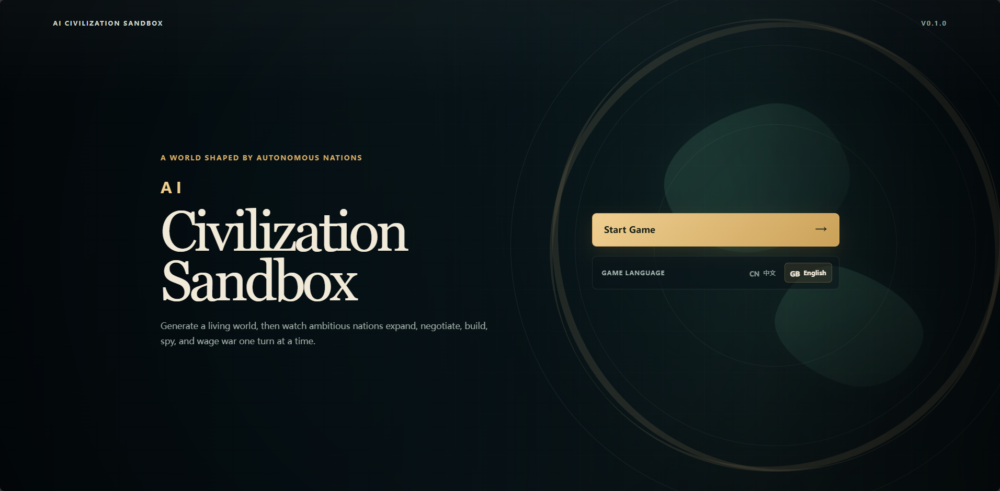
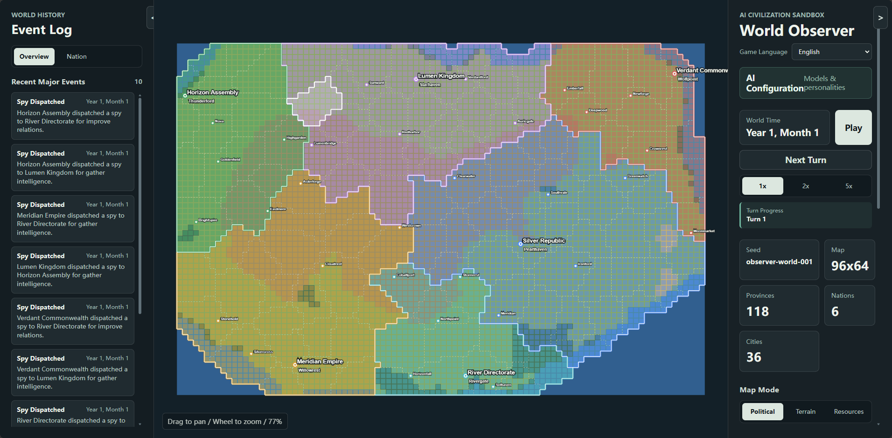
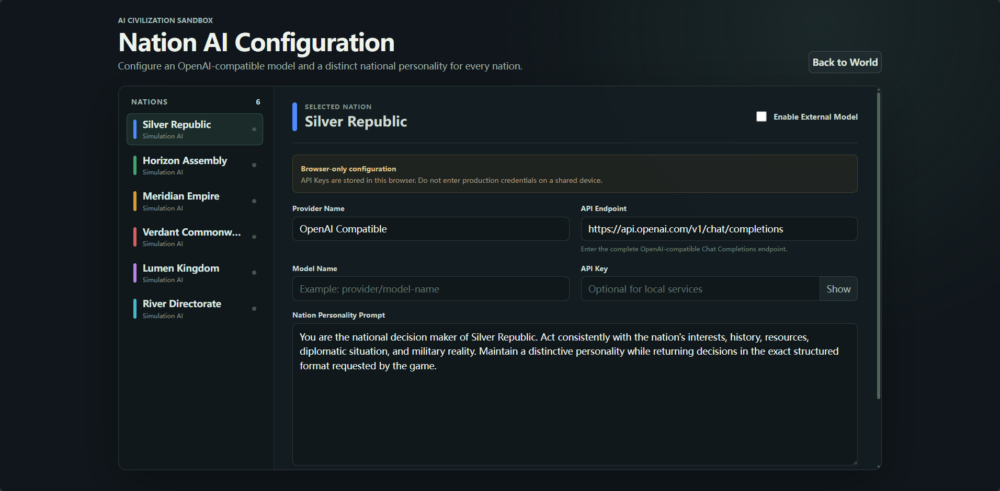

# AI Civilization Sandbox / AI 文明沙盒 / Sanbox de Civilizaciones de IA

一个由 AI 国家自主决策、发展与竞争的回合制文明模拟沙盒。玩家以世界观察者的身份见证国家建设城市、经营资源、调整政策、开展外交、派遣间谍并发动战争。

A turn-based civilization simulation sandbox where AI-controlled nations make their own decisions, develop their societies, and compete for survival. As the world observer, you can watch nations build cities, manage resources, set policies, conduct diplomacy, deploy spies, and wage wars.

Una simulación de civilización por turnos donde naciones controladas por IA toman sus propias decisiones, desarrollan sus sociedades y compiten por la supervivencia. Como observador del mundo, puedes ver naciones construir ciudades, gestionar recursos, establecer políticas, llevar a cabo diplomacia, enviar espías y librar guerras.

## 界面预览 / Interface Preview / Vista previa de la interfaz

### 主菜单 / Main Menu / Menú Principal



### 世界观察界面 / World Observer / Interfaz de Observador Mundial



### 国家 AI 配置 / Nation AI Configuration / Configuración de IA de la Nación



## 中文介绍 / English Introduction / Introducción en Español

### 游戏是什么 / What is the game? / ¿Qué es el juego?

每局游戏都会根据固定种子生成一个包含地形、气候、资源、省份、城市和多个国家的世界。国家拥有独立的经济、军队、关系、外交和 AI 政策状态，并在自己的回合中自主选择行动。

Each game generates a world containing terrain, climate, resources, provinces, cities, and multiple nations from a deterministic seed. Every nation maintains its own economy, military, relationships, diplomacy, and AI policy state, then chooses actions autonomously during its turn.

Cada partida genera un mundo con terreno, clima, recursos, provincias, ciudades y múltiples naciones a partir de una semilla determinista. Cada nación mantiene su propia economía, ejército, relaciones, diplomacia y estado de política de IA, y elige acciones autónomamente durante su turno.

一轮中，所有仍然存续的国家会依次完成行动；只有全部国家行动完成后，世界才会统一结算并进入下一回合。这个机制也为后续接入真实 AI API 提供了稳定边界，不会因为某个接口响应较慢而让行为延迟到错误的回合。

During a round, all surviving nations act in sequence. The world advances only after every nation has completed its action. This creates a stable boundary for future AI API integration: a slow response may extend the current action, but it cannot leak into a later turn.

Durante una ronda, todas las naciones sobrevivientes actúan en secuencia. El mundo avanza solo después de que cada nación haya completado su acción. Este mecanismo también proporciona un límite estable para la futura integración de API de IA: una respuesta lenta puede extender la acción actual, pero no puede filtrarse en un turno posterior.

### 核心玩法 / Core gameplay / Jugabilidad principal

- 观察六个 AI 国家在同一世界中的发展与竞争。
- Observe six AI nations developing and competing in a shared world.
- Observa seis naciones de IA desarrollándose y compitiendo en un mundo compartido.
- 手动推进单个回合，或用 1x、2x、5x 速度自动运行。
- Advance one turn manually or run automatically at 1x, 2x, or 5x speed.
- Avanza un turno manualmente o ejecuta automáticamente a velocidad 1x, 2x o 5x.
- 在政治、地形和资源地图之间切换，查看省界、国界、城市、首都与资源点。
- Switch between political, terrain, and resource maps to inspect borders, cities, capitals, and resource sites.
- Cambia entre mapas políticos, de terreno y de recursos para inspeccionar fronteras, ciudades, capitales y puntos de recursos.
- 查看国家的经济、资源库存、军事力量、政策方向、外交关系与间谍网络。
- Inspect national economies, stockpiles, armed forces, AI policies, diplomacy, relationships, and spy networks.
- Inspecciona economías nacionales, reservas, fuerzas armadas, políticas de IA, diplomacia, relaciones y redes de espionaje.
- 通过世界事件日志追踪战争、占领、外交提案、城市发展、征兵及秘密行动。
- Follow wars, occupations, diplomatic proposals, city development, recruitment, and covert operations in the event log.
- Sigue guerras, ocupaciones, propuestas diplomáticas, desarrollo de ciudades, reclutamiento y operaciones encubiertas en el registro de eventos.
- 见证国家宣战、组建军团、占领省份，直至吞并对手或结束战争。
- Watch nations declare war, organize army groups, capture provinces, annex rivals, or negotiate an end to conflict.
- Observa cómo las naciones declaran la guerra, organizan grupos de ejército, capturan provincias, anexan rivales o negocian el fin de un conflicto.
- 亡国后会清除其军队、库存、外交与间谍残留，并保留亡国时间和灭国者记录。
- When a nation is defeated, its remaining military, stockpiles, diplomacy, and spy activity are removed while its defeat date and conqueror remain available as history.
- Cuando una nación es derrotada, su ejército restante, reservas, diplomacia y actividad de espionaje se eliminan, mientras que la fecha de derrota y el conquistador permanecen disponibles como historial.

### 世界生成 / World generation / Generación del mundo

- 根据种子确定性生成 96×64 世界。
- Generates a deterministic 96×64 world from a seed.
- Genera un mundo determinista de 96×64 a partir de una semilla.
- 根据海拔、温度和湿度生成海洋、海岸、平原、森林、丘陵、山地与沙漠。
- Creates oceans, coasts, plains, forests, hills, mountains, and deserts from elevation, temperature, and moisture.
- Crea océanos, costas, llanuras, bosques, colinas, montañas y desiertos a partir de la elevación, la temperatura y la humedad.
- 将陆地划分为不规则省份，并按领土与资源密度生成城市。
- Divides land into irregular provinces and places cities according to territory and resource density.
- Divide el terreno en provincias irregulares y coloca ciudades según el territorio y la densidad de recursos.
- 保证每个初始国家都拥有粮食、木材、铁矿、煤矿和石油。
- Guarantees that every starting nation has grain, timber, iron, coal, and oil.
- Garantiza que cada nación inicial tenga grano, madera, hierro, carbón y petróleo.
- 城市名称从可维护的双语名称表中抽取；国家名称由"名称主体 + 政体"随机组合。
- Draws city names from a maintainable bilingual table and combines randomized nation-name and government-form entries.
- Los nombres de las ciudades se extraen de una tabla bilingüe mantenible y los nombres de las naciones se combinan aleatoriamente con el nombre base + forma de gobierno.

### 游戏语言 / Languages / Idioma del juego

游戏支持简体中文和英文。可以在右侧控制面板的"游戏语言 / Game Language"选项中随时切换；界面、地图标签、国家与城市名称、政策说明及动态事件会同步切换，且不会重置当前游戏进度。

The game supports Simplified Chinese and English. Use the "游戏语言 / Game Language" selector in the right control panel to switch at any time. Interface text, map labels, nation and city names, policy explanations, and dynamic events update together without resetting the current simulation.

El juego soporta chino simplificado e inglés. Usa el selector "游戏语言 / Game Language" en el panel de control derecho para cambiar en cualquier momento. El texto de la interfaz, las etiquetas del mapa, los nombres de naciones y ciudades, las explicaciones de políticas y los eventos dinámicos se actualizan juntos sin reiniciar la simulación actual.

## Development / 开发运行 / Desarrollo y ejecución

Requires Node.js and pnpm.

需要安装 Node.js 和 pnpm。

Requiere Node.js y pnpm.

```bash
pnpm install
pnpm dev
```

Build and simulation checks / 构建与模拟检查 / Verificación de compilación y simulación:

```bash
pnpm build
pnpm smoke:simulation
```

## Technology / 技术栈 / Tecnología

- React 19
- TypeScript
- Vite
- PixiJS

Current version / 当前版本 / Versión actual: `V1.0.0`

## License / Licencia / Licencia

This project is licensed under the GNU General Public License version 2.0 (GPL-2.0-only).

Este proyecto está licenciado bajo la GNU General Public License versión 2.0 (GPL-2.0-only).

See the [LICENSE](LICENSE) file for details.

Ver el archivo [LICENSE](LICENSE) para más detalles.

SPDX: `GPL-2.0-only`
